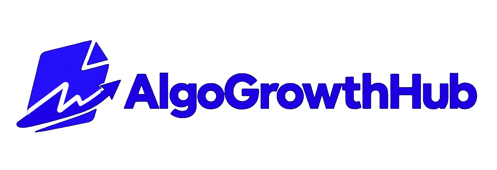
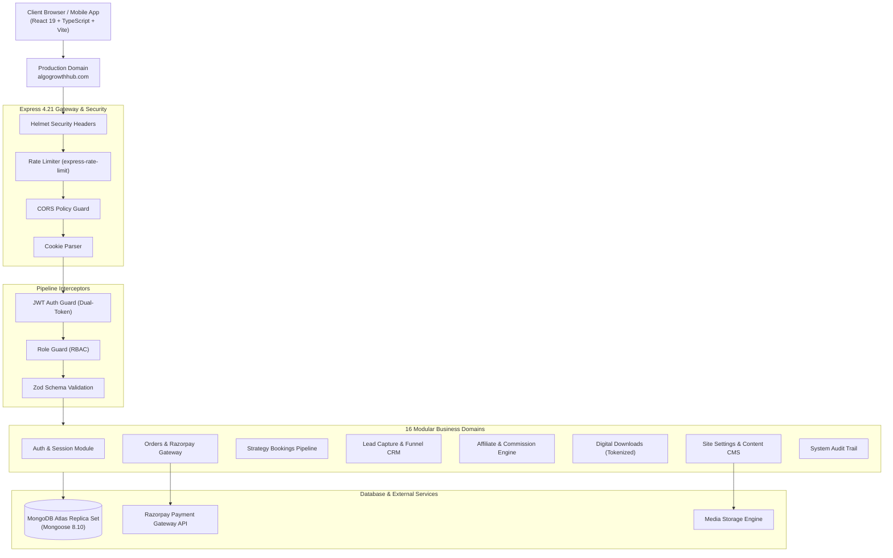

# ⚡ AlgoGrowthHub — Enterprise Digital Growth & Creator Monetization Platform

<div align="center">



### **High-Performance Full-Stack Agency & Creator Acceleration SaaS**

[](https://algogrowthhub.com)
[](https://www.typescriptlang.org/)
[](https://react.dev/)
[](https://nodejs.org/)
[](https://expressjs.com/)
[](https://www.mongodb.com/)
[](https://vitejs.dev/)
[](./LICENSE)

---

### 🌐 **Live Production Deployment:** [https://algogrowthhub.com](https://algogrowthhub.com)  
### 📖 **Comprehensive API Specs:** [`BACKEND_API_DOCUMENTATION.md`](./BACKEND_API_DOCUMENTATION.md)

</div>

---

## 📌 Table of Contents
1. [Overview & Business Context](#-overview--business-context)
2. [Key Architecture & Engineering Highlights](#-key-architecture--engineering-highlights)
3. [System Architecture Diagram](#-system-architecture-diagram)
4. [Core Features & Modules](#-core-features--modules)
   - [Customer & Public Experience](#1-customer--public-experience)
   - [Admin Command Center (CMS & Operations)](#2-admin-command-center-cms--operations)
   - [Partner & Referral Affiliate Engine](#3-partner--referral-affiliate-engine)
   - [E-Commerce & Digital Resource Protection](#4-e-commerce--digital-resource-protection)
5. [Tech Stack](#-tech-stack)
6. [API Architecture & Endpoints](#-api-architecture--endpoints)
7. [Security & Authentication Hardening](#-security--authentication-hardening)
8. [Local Development & Quickstart](#-local-development--quickstart)
9. [Environment Variables](#-environment-variables)
10. [Testing & Quality Assurance](#-testing--quality-assurance)

---

## 🚀 Overview & Business Context

**AlgoGrowthHub** is a production-grade digital acceleration platform and SaaS built for modern social media agencies, high-ticket creators, and brands. 

Rather than a static agency showcase, AlgoGrowthHub functions as a **complete client acquisition, digital monetization, and operational pipeline**:
- **Monetization Engine:** Handles paid consultation bookings, digital playbook checkouts with Razorpay SDK verification, and tokenized instant downloads.
- **Affiliate & Referral Engine:** Custom referral links, attribution tracking cookies, automated commission calculations, and partner analytics dashboards.
- **Enterprise Content CMS:** Full dynamic CMS powering client success case studies (before/after metrics), service grids, creator rosters, team directories, and site SEO metadata.
- **Operations & Lead CRM:** Integrated lead intake pipeline, automated audit logging for admin actions, and real-time revenue analytics.

---

## 💎 Key Architecture & Engineering Highlights

* **Domain-Driven Modular Architecture (DDD):** Backend is decoupled into 16 independent domain modules (`auth`, `users`, `orders`, `payments`, `bookings`, `leads`, `referrals`, `resources`, `auditLogs`, etc.) with dedicated models, controllers, services, and route layers.
* **Dual-Token JWT Authentication:** Short-lived access tokens (15m memory/header) paired with secure `HttpOnly`, `SameSite` refresh cookie rotation for zero-vulnerability session persistence.
* **Strict Type Safety End-to-End:** 100% written in TypeScript 5.7 across both Client and Server, with Zod runtime schema validations guarding all mutation payloads.
* **High-Resiliency MongoDB Setup:** Designed for replica-set clusters with explicit fallback strategies to maintain continuous uptime under varying DNS and network topologies.
* **Granular RBAC Guards:** Tiered permissions separating `SUPER_ADMIN`, `ADMIN`, `PARTNER`, and `CLIENT` with route-level middleware protection.
* **Audit Logging Subsystem:** Every administrative update, settings change, and status progression is automatically written to an immutable audit trail.

---

## 🏗️ System Architecture Diagram



---

## ✨ Core Features & Modules

### 1. Customer & Public Experience
- **Fluid Modern UI:** Tailored with Google Fonts (*Plus Jakarta Sans* & *Inter*), dark/light responsive layouts, smooth micro-interactions, and Lucide vector graphics.
- **Interactive Service Matrix:** Modular 3x3 service card grid with real-time detail modal breakdowns.
- **Client Results & Proof Engine:** Verified growth metrics, before/after statistics, follower milestones, and rating showcases.
- **1-on-1 Consultation Booking:** Calendar-based slot picker and lead qualification funnel with instant confirmation.

### 2. Admin Command Center (CMS & Operations)
- **High-Throughput Dashboard:** Real-time metrics tracking total revenue, monthly recurring bookings, active leads, and referral conversion rates.
- **Complete Content Management (CMS):** Update hero banners, testimonials, team rosters, FAQ accordions, and pricing tiers dynamically without redeploying code.
- **Lead Pipeline:** Kanban-style lead status tracking (`NEW` ➔ `CONTACTED` ➔ `QUALIFIED` ➔ `WON` ➔ `LOST`).
- **Audit Logs:** Immutable audit log tracking IP addresses, timestamps, admin identities, and target entities.

### 3. Partner & Referral Affiliate Engine
- **Custom Referral Tracking:** Unique link creation (`/ref/:code`) with persistent cookie attribution.
- **Automated Payout Calculations:** Configurable percentage/fixed commissions calculated on order and booking settlements.
- **Partner Portal:** Self-serve dashboard where affiliates monitor clicks, converted sales, and pending payouts.

### 4. E-Commerce & Digital Resource Protection
- **Razorpay Checkout SDK Integration:** Server-side cryptographic signature verification (`razorpay_order_id`, `razorpay_payment_id`, `razorpay_signature`).
- **Protected Digital Assets:** Premium ebooks, templates, and video guides delivered through secure, one-time expiring download tokens.

---

## 🛠️ Tech Stack

### **Frontend**
| Technology | Description |
| :--- | :--- |
| **React 19** | Modern component architecture, hooks, and concurrent features |
| **TypeScript 5.7** | End-to-end type safety, interfaces, and strict type checking |
| **Vite 6** | Lightning-fast build tooling and HMR dev server |
| **React Router 7** | Client-side routing, nested layouts, and route guards |
| **Axios** | HTTP client with automatic token attachment and interceptors |
| **Lucide Icons** | Lightweight, scalable vector icons |
| **Tailwind CSS** | Utility-first responsive design system |

### **Backend**
| Technology | Description |
| :--- | :--- |
| **Node.js (ESM)** | Modern ECMAScript module runtime (v20+ / v24+) |
| **Express 4.21** | REST API framework structured in modular DDD pattern |
| **MongoDB Atlas** | Cloud database managed through Mongoose 8.10 ODM schemas |
| **Zod 3.24** | Declarative runtime input validation and sanitization |
| **Bcrypt.js** | Cryptographic password hashing (12 rounds) |
| **JSONWebToken** | Dual-token authentication with Access & Refresh tokens |
| **Helmet & Cors** | Security headers and cross-origin resource sharing protection |
| **Express Rate Limit** | Tiered rate limiting against brute-force and DDoS attacks |

---

## 📡 API Architecture & Endpoints

All endpoints are versioned under `/api/v1`. Comprehensive request/response bodies and error schemas are documented in [`BACKEND_API_DOCUMENTATION.md`](./BACKEND_API_DOCUMENTATION.md).

| Module | Route Prefix | Key Functionality |
| :--- | :--- | :--- |
| **Auth** | `/api/v1/auth` | User/Admin login, token refresh, logout, profile fetch |
| **Users** | `/api/v1/users` | RBAC user management, roles, status changes |
| **Settings** | `/api/v1/settings` | Global CMS settings (Hero, About, Footer, SEO metadata) |
| **Services** | `/api/v1/services` | Service catalog CRUD, deliverables, pricing tiers |
| **Creators** | `/api/v1/creators` | Creator community roster, Instagram metrics showcase |
| **Team** | `/api/v1/team` | Expert leadership profiles and social handles |
| **Results** | `/api/v1/results` | Verified before/after client case studies & reviews |
| **Resources** | `/api/v1/resources` | Free & premium digital downloads with tokenized URLs |
| **Bookings** | `/api/v1/bookings` | 1-on-1 strategy call bookings & scheduling pipeline |
| **Leads** | `/api/v1/leads` | Inbound client intake funnel and status lifecycle |
| **Orders** | `/api/v1/orders` | Order creation, payment state machine, invoice data |
| **Payments** | `/api/v1/payments` | Razorpay signature verification and webhook processing |
| **Referrals** | `/api/v1/referrals` | Affiliate codes, link tracking, partner commission ledger |
| **Audit Logs**| `/api/v1/audit-logs` | Tamper-proof administrative action trail |

---

## 🔒 Security & Authentication Hardening

```text
[Client Request] 
      │
      ▼
┌────────────────────────────────────────────────────────┐
│ 1. Rate Limiting: 100 req / 15 min per IP              │
│ 2. Helmet: Content-Security-Policy & HSTS              │
│ 3. CORS: Whitelisted domain (algogrowthhub.com) only   │
└──────────────────────────┬─────────────────────────────┘
                           ▼
┌────────────────────────────────────────────────────────┐
│ 4. Access Token verification (Header Bearer)           │
│    - Expired? ➔ Refresh via HttpOnly Cookie (7 Days)   │
│ 5. Role-Based Permission Check (RBAC)                  │
│ 6. Zod Runtime Schema Validation & Sanitization        │
└──────────────────────────┬─────────────────────────────┘
                           ▼
                  [Domain Controller]
```

* **Password Security:** Salted with 12 rounds of `bcrypt`.
* **Cookie Isolation:** Refresh tokens are dispatched with `httpOnly: true`, `secure: true`, and `sameSite: "strict"`.
* **Zero Secret Leakage:** Strict `.gitignore` policy prevents private keys and DB connection strings from ever entering version control.

---

## 💻 Local Development & Quickstart

### Prerequisites
* **Node.js** v20.x or higher
* **npm** v10.x or higher
* **MongoDB** connection string (Local or MongoDB Atlas)

### 1. Clone the Repository
```bash
git clone https://github.com/gy60540-netizen/AlgoGrowthHub.git
cd AlgoGrowthHub
```

### 2. Configure Backend
```bash
cd server
npm install

# Copy environment variables template
cp .env.example .env
# Edit .env with your MongoDB URI, JWT secrets, and Razorpay keys
```

### 3. Seed Initial Database & Super Admin
```bash
# Automatically seeds default settings, services, resources, and admin credentials
npm run seed
```

### 4. Start Backend Server
```bash
npm run dev
# Server boots on http://localhost:5000 (API: http://localhost:5000/api/v1)
```

### 5. Configure & Start Frontend
In a separate terminal:
```bash
cd client
npm install
npm run dev
# Frontend boots on http://localhost:5173
```

---

## ⚙️ Environment Variables

### Backend (`server/.env`)
```ini
NODE_ENV=development
PORT=5000
CLIENT_URL=http://localhost:5173

# Database Connection (MongoDB Atlas Cluster)
MONGO_URI=mongodb+srv://<user>:<password>@cluster0.mongodb.net/algogrowthhub?retryWrites=true&w=majority

# JWT Authentication
JWT_ACCESS_SECRET=your_super_secret_access_key_min_32_chars
JWT_REFRESH_SECRET=your_super_secret_refresh_key_min_32_chars
JWT_ACCESS_EXPIRY=15m
JWT_REFRESH_EXPIRY=7d

# Initial Super Admin Seed Credentials
SUPER_ADMIN_EMAIL=admin@algogrowthhub.com
SUPER_ADMIN_PASSWORD=SuperSecurePassword123!

# Razorpay Payment Gateway (Optional for local testing)
RAZORPAY_KEY_ID=rzp_test_xxxxxxxxxx
RAZORPAY_KEY_SECRET=your_razorpay_secret
```

### Frontend (`client/.env`)
```ini
VITE_API_BASE_URL=http://localhost:5000/api/v1
VITE_RAZORPAY_KEY_ID=rzp_test_xxxxxxxxxx
```

---

## 🧪 Testing & Quality Assurance

The codebase includes end-to-end integration and scenario tests:

```bash
# Run backend test suite
cd server
npm run test

# Run end-to-end scenario validation script
npm run test:e2e
```

---

## 👨‍💻 Developer & Contact

**Developed by:** Gaurav ([@gy60540-netizen](https://github.com/gy60540-netizen))  
**Official Website:** [https://algogrowthhub.com](https://algogrowthhub.com)  
**Email:** [gy60540@gmail.com](mailto:gy60540@gmail.com)  

*Built with passion for scalable web architecture, clean code, and production reliability.*
